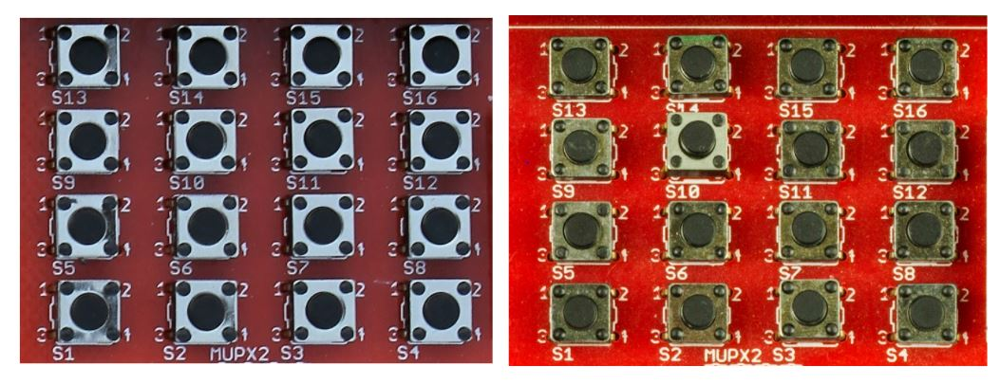
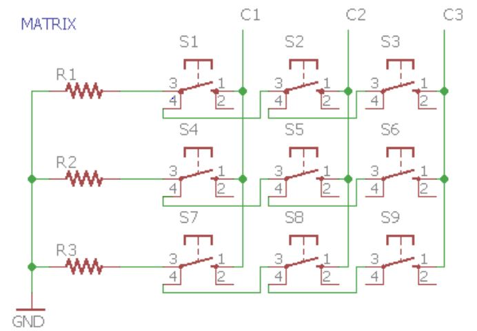
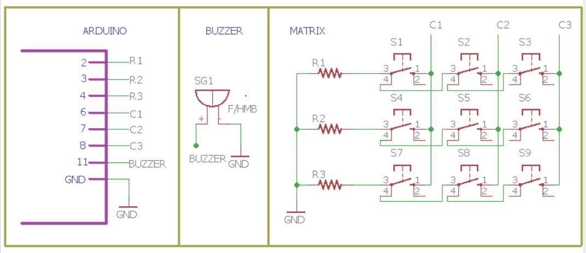
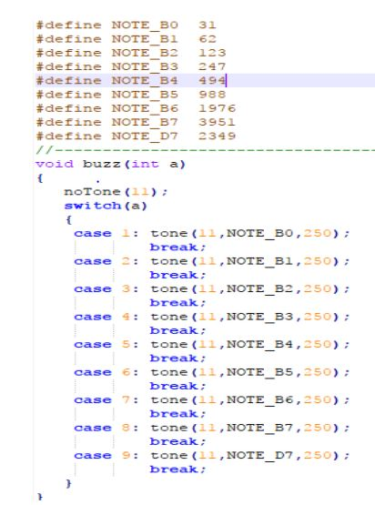
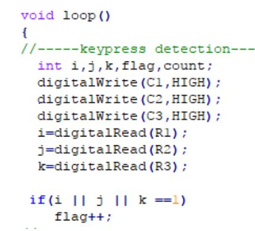
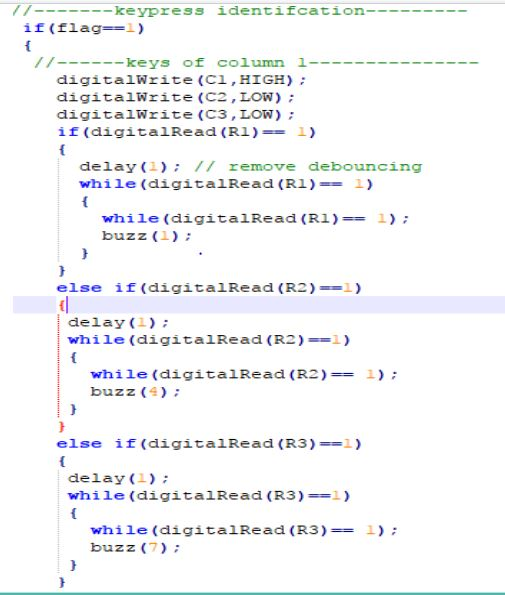

*************
KEYPAD INTERFACING
*************
KEYPAD
======

HIGH SIDE SWITCHING
===================
.. image:: ../../_static/images/lecture11_pg3.JPG
    :align: center

LOW SIDE SWITCHING
==================
.. image:: ../../_static/images/lecture11_pg4.JPG
    :align: center

KEYPAD CONNECTIONS
==================

EXERCISE
=========
- Based on switch array input change the frequency of sound at which the buzzer beeps

HARDWARE
=========

SOFTWARE
========

Practise Exercise
==================
- Based on switch array set some tone