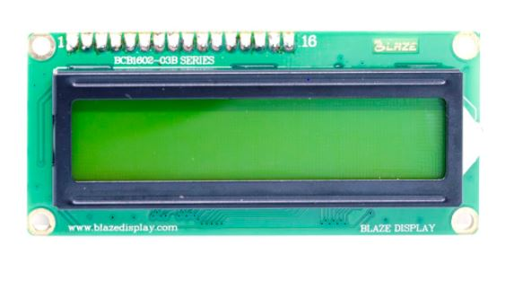
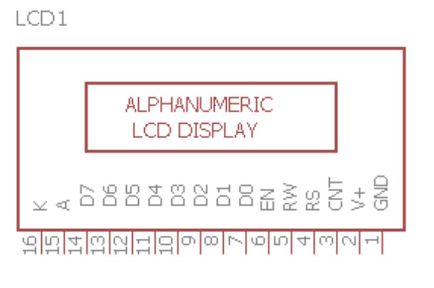
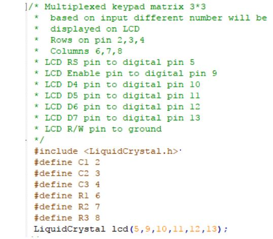
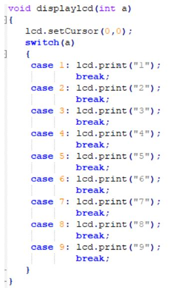

********************
LCD INTERFACING
********************

WHAT IS LCD?
============

EXERCISE
========
- To display the number of the keypad (the one we used in last exercise) on the LCD

HARDWARE
=========
.. image:: ../../_static/images/lecture12_pg5.JPG
    :align: center

SOFTWARE
==========

.. image:: ../../_static/images/lecture12_pg8.JPG
    :align: center