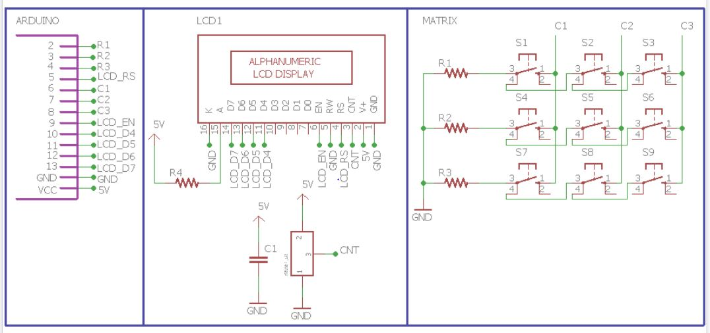
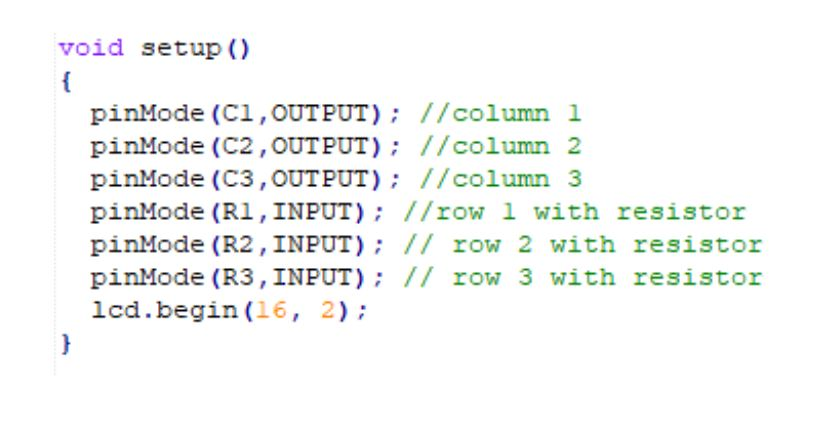

********************
LCD INTERFACING
********************

WHAT IS LCD?
============
.. image:: ../../_static/images/lecture12_pg2.JPG
    :align: center

EXERCISE
========
- To display the number of the keypad (the one we used in last exercise) on the LCD

HARDWARE
=========

SOFTWARE
==========

