*********
INSTALLATION
*********

Arduino IDE
===========
- **Free and Open-source**
- **Easy-to-use**
- **Compatible** 
- **Easy-to-understand**
- **Reliable**

Download
========
- To download the Arduino IDE, open url `<https://www.arduino.cc/en/Main/Software>`_.
- Now select the download file based on your operating system.
.. image:: ../../_static/images/lecture2_pg3.JPG
    :align: center
.. image:: ../../_static/images/lecture2_pg4.JPG
    :align: center

Installation (Windows)
======================
- Now click on the downloaded file to start the installation.
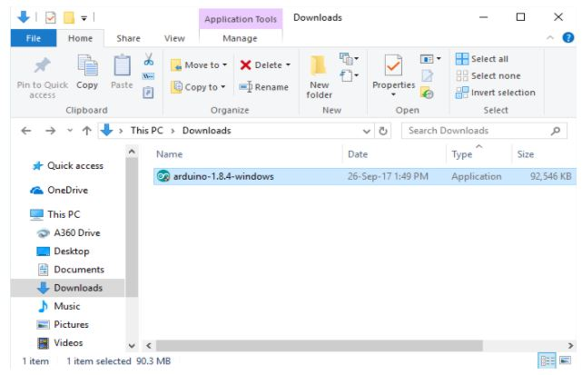
- Now accept the license agreement by clicking on I Agree button.
.. image:: ../../_static/images/lecture2_pg6.JPG
    :align: center
- Click on Next to install various components of Arduino IDE Setup.
.. image:: ../../_static/images/lecture2_pg7.JPG
    :align: center
- Now select the directory for installation and click Install button. 
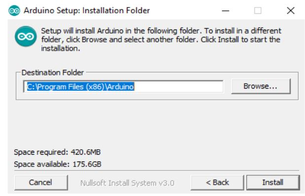
- The following dialogue box appears, click Close after the installation is completed.
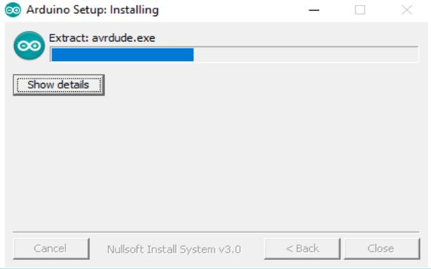
- If the drivers are not pre-installed on your desktop, then a series of driver installation dialog box will appear. Click Install to install the necessary drivers.
.. image:: ../../_static/images/lecture2_pg10.JPG
    :align: center
- The installation has been completed. 
- Now click on the desktop icon to start the Arduino IDE.
.. image:: ../../_static/images/lecture2_pg11.JPG
    :align: center

Installation (Linux)
====================
- Extract the downloaded package. 
.. image:: ../../_static/images/lecture2_pg12.JPG
    :align: center
- In the extracted folder, find the install.sh file.
- Right click on it and chose the Run in Terminal from contextual menu.
.. image:: ../../_static/images/lecture2_pg13.JPG
    :align: center
- If you can’t find the Run in Terminal option from contextual menu, then open Terminal and navigate to the extracted folder
- Type the command ./install.sh and wait for the process to finish
- Now, the Arduino IDE has been installed
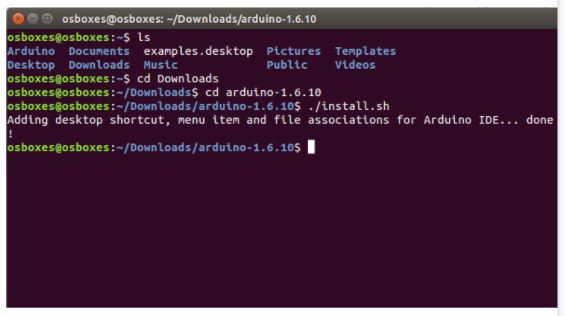
- It might be the case that you would not be able to upload the sketch because of serial port permission. The corresponding error message is **”Error connecting to Serial Port”**
- To set the permission, open Terminal and type ** ls -l /dev/ttyACM* **
- The data we need is ‘dialout’(this is the group owner of the file)
- Now we need to add our user to that group with the help of the following command  **“sudo usermod -a -G dialout <username>”**
.. image:: ../../_static/images/lecture2_pg15.JPG
    :align: center

Installation (Mac OS X)
=======================
- Extract the downloaded package. 
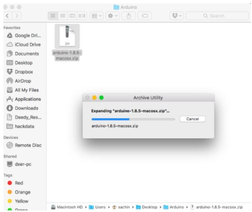
- Copy the Arduino application into the Applications folder or any other location. 
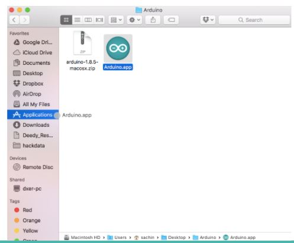
- The installation has been completed. 
- Now click on the Arduino icon to start the Arduino IDE.
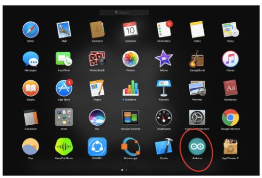

User Interface
==============
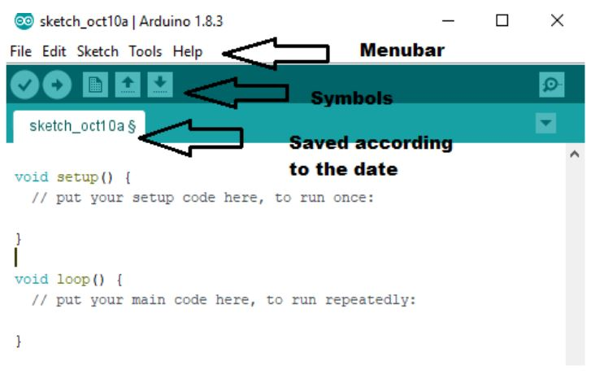
File Tab and Edit Tab
===============
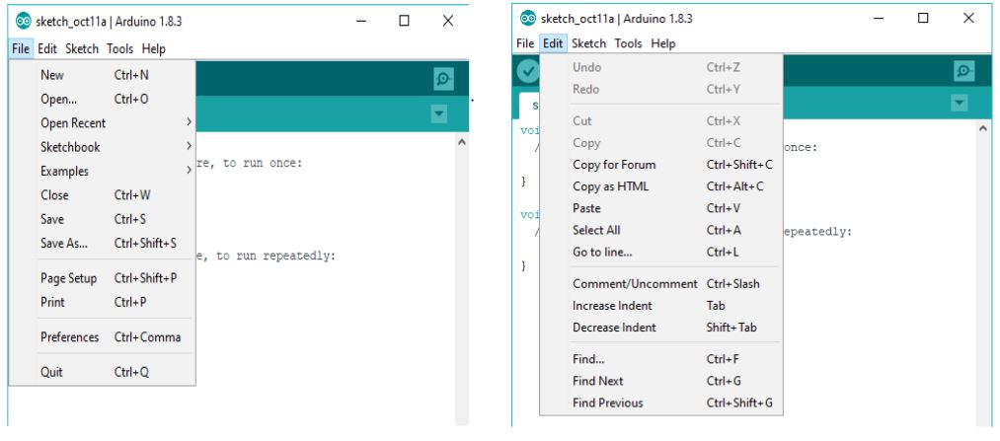
Sketch Tab and Tools Tab
===============
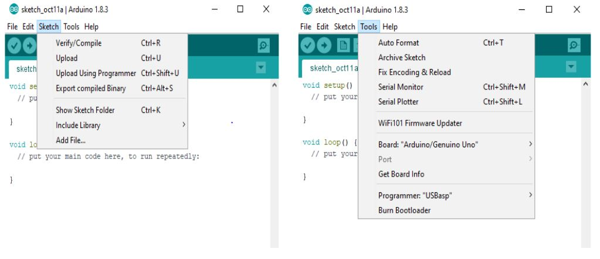
Meaning of Symbols-Verify
===============
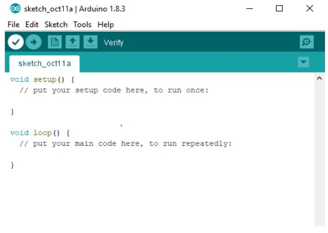
Upload
===============
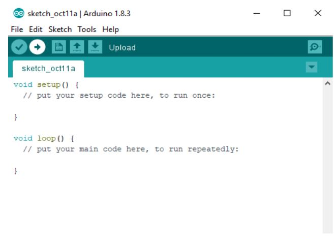
New
===============
.. image:: ../../_static/images/lecture2_pg24.JPG
    :align: center
Open
===============
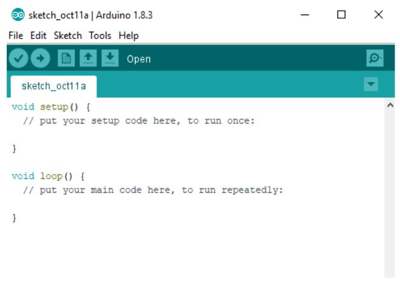
Save
===============
.. image:: ../../_static/images/lecture2_pg26.JPG
    :align: center
Serial Monitor
===============
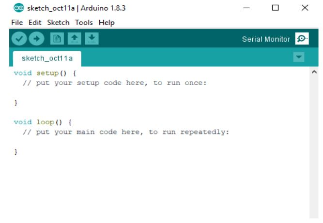
Functions
===============
.. image:: ../../_static/images/lecture2_pg28.JPG
    :align: center
