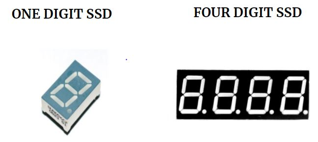
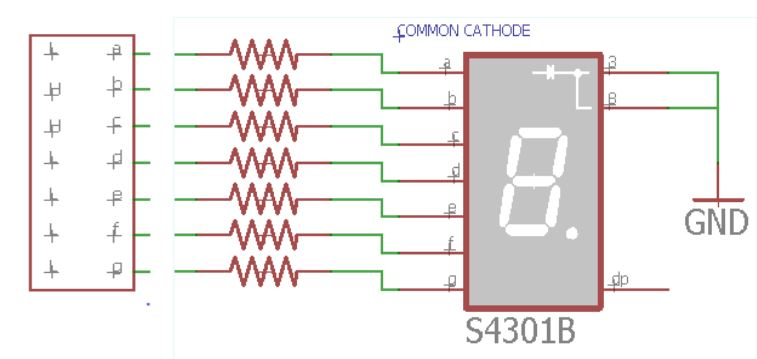
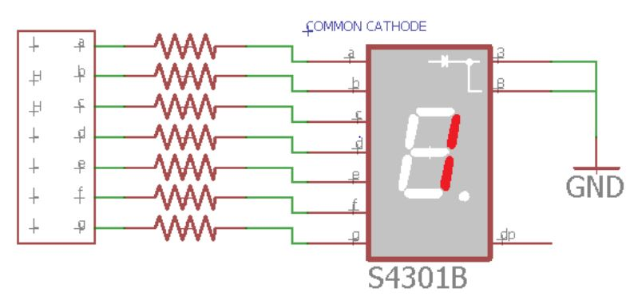
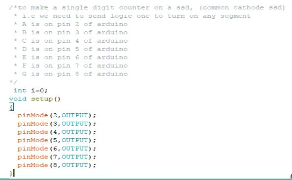

********************
INTRODUCTION TO SSD
********************

SEVEN SEGMENT DISPLAY(SSD)
==========================

WHAT IS SSD?
^^^^^^^^^^^^
.. image:: ../../_static/images/lecture5_pg3.JPG
    :align: center

Seven Segment Display (SSD) or seven segment Indicator is an electronic device which helps display decimal numerals and English alphabets.

TYPES OF SSD
^^^^^^^^^^^^^
.. image:: ../../_static/images/lecture5_pg4.JPG
    :align: center

COMMON CATHODE SSD
^^^^^^^^^^^^^^^^^^
.. image:: ../../_static/images/lecture5_pg5.JPG
    :align: center
In common cathode all the cathodes are tied to a common pin, in this case generally ground, and the LED are driven by the state of the anodes where ground is off and power is on.

COMMON ANODE SSD
^^^^^^^^^^^^^^^^^
.. image:: ../../_static/images/lecture5_pg6.JPG
    :align: center
In common anode all the anodes on the display are tied to a common pin, typically the power source, and the LED are controlled via the cathodes with ground being on and power being off.

DRIVING A LED TYPE SSD
^^^^^^^^^^^^^^^^^^^^^^^

EXERCISE
^^^^^^^^^^^^^^^^^^^^^^^
- To make a single digit counter
HARDWARE
^^^^^^^^^^^^^^^^^^^^^^^
.. image:: ../../_static/images/lecture5_pg10.JPG
    :align: center
When we write digital high on pins of arduino the current flows and led’s are turned on.

SOFTWARE
^^^^^^^^^^

.. image:: ../../_static/images/lecture5_pg12.JPG
    :align: center
.. image:: ../../_static/images/lecture5_pg13.JPG
    :align: center
A basic arduino code will involve two functions for sure: setup and loop. Setup function does not return any value and accepts no parameters. It is used to initialize our hardware. 

Practice Problem
^^^^^^^^^^^^^^^^^
- Make a four digit counter using four digit seven segment display
