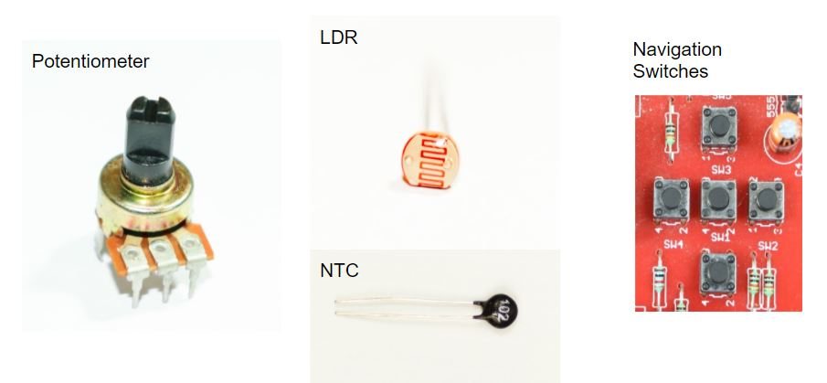
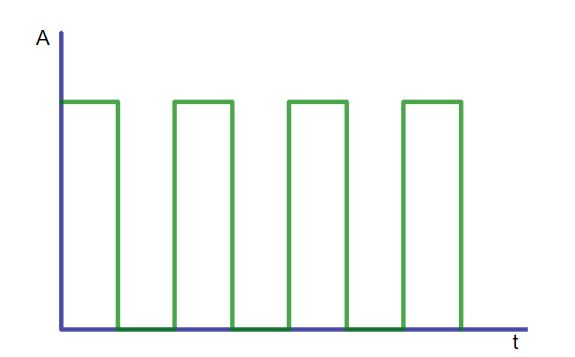
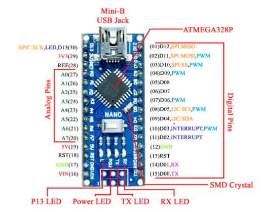
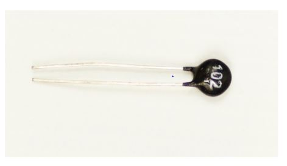
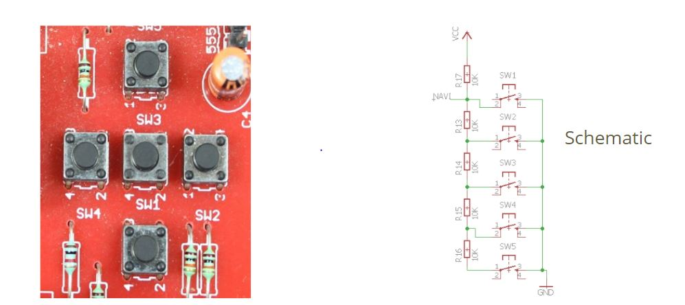
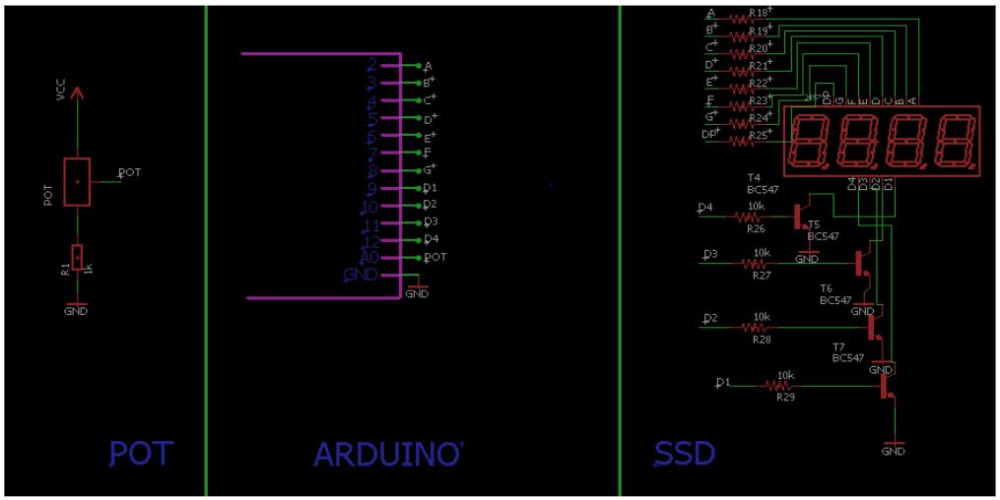
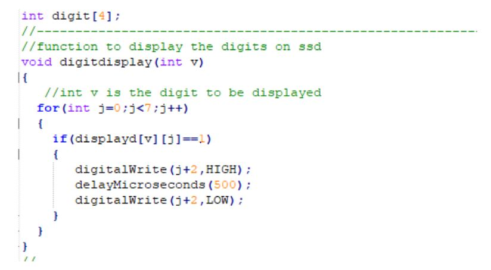
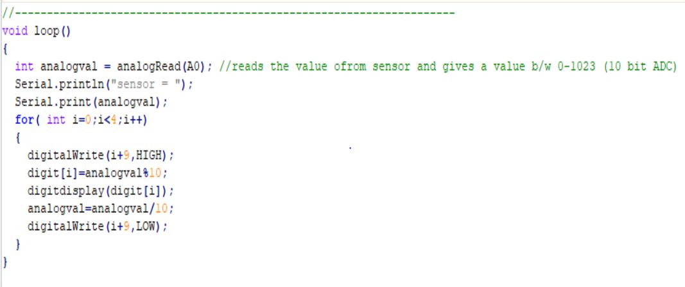

******************
ANALOG OPERATIONS
******************

ANALOG INPUTS
==============

What are Analog signals?
========================
.. image:: ../../_static/images/lecture6A_pg3.JPG
    :align: center
An Analog signal is a time varying signals which can take any value between a specific range and is defined at each point of time.

What are digital signals?
=========================

Digital signals are the signals which have a finite set of possible values and they cannot take any other value.

What is ADC?
=============
.. image:: ../../_static/images/lecture6A_pg5.JPG
    :align: center
It stands for **Analog to Digital Converter**

Analog to Digital converter(ADC)
================================

Way to convert an analog value to a digital value in Arduino

 5   ------> 1023
 1   ------> 1023 / 5

 3   ------> (1023/5)*3 = 614

Light Dependent Resistor (LDR)
==============================
.. image:: ../../_static/images/lecture6A_pg7.JPG
    :align: center
.. image:: ../../_static/images/lecture6A_pg8.JPG
    :align: center
As it's obvious from the name, LDR or a photoresistor is a resistor which changes its resistance value depending upon the intensity of light which falls on it.

Variable Voltage Divider from LDR
=================================
.. image:: ../../_static/images/lecture6A_pg9.JPG
    :align: center

POTENTIOMETER
=============
.. image:: ../../_static/images/lecture6B_pg3.JPG
    :align: center
A potentiometer is a three terminal device with which enables us to vary the resistance to make a voltage divider.

Potentiometer as a Analog Input
^^^^^^^^^^^^^^^^^^^^^^^^^^^^^^^
.. image:: ../../_static/images/lecture6B_pg4.JPG
    :align: center

NTC Thermistors
===============

A thermistor is a resistor whose resistance depends upon the temperature of the environment it is kept in. NTC is acronym for “Negative Temperature Coefficient”. Thus, NTC Thermistor is a device whose resistance decreases with increase in temperature.

NTC as an Analog Input
^^^^^^^^^^^^^^^^^^^^^^^^
.. image:: ../../_static/images/lecture6B_pg6.JPG
    :align: center

NAVIGATION KEYS 
===============

EXERCISE: 
=========
- To display ADC value from potentiometer on SSD

HARDWARE
=========

SOFTWARE
=========

