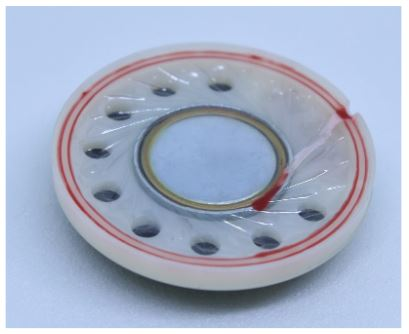
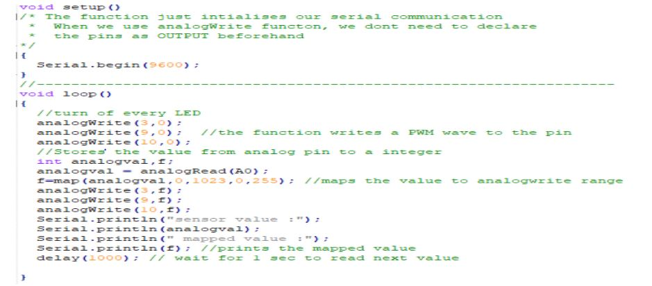

****************
LECTURE 8
****************

Pulse Width Modulation(PWM)
===========================
.. image:: ../../_static/images/lecture8_pg2.JPG
    :align: center

(COMMENTS WERE THERE REGARDING PICTURES OF DIFFERENT SPEAKERS)

EXERCISE:
=========
- Based on Analog Input change the intensity of the three different LEDs 

HARDWARE
=========
.. image:: ../../_static/images/lecture8_pg5.JPG
    :align: center
**~** This symbol should be in front of the pins because on Arduino PWM wave is enabled on these

SOFTWARE
=========
